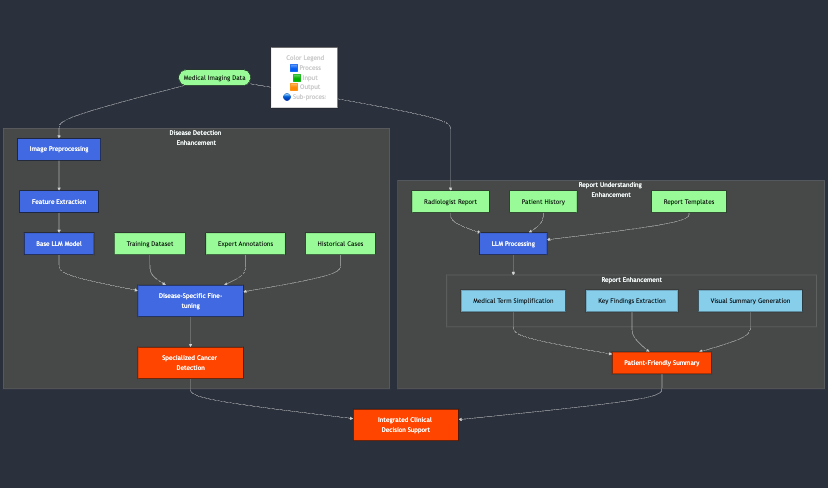

# Team 17
Aadit Kapoor: Model Architecture, Knowledge Extractor using BioBert 
 
Sasank Perumal: Fine Tuning, Frontend (Streamlit)
 
Venkata Surya Kiran Naidu Vakkalagadda: Evaluation, EDA

# Introduction
Radiology by nature generates a lot of text data, this makes it an ideal case for an LLM. Some examples of the data modalities generated are as follows:
Reports
Clinical Notes with associated Images

The motivation behind this project stems from the significant challenges and costs associated with medical image analysis, particularly in radiology. Currently,  (1) radiologists spend extensive hours reviewing and interpreting medical images before generating detailed reports, a process that can take several hours per image. With the average radiologist in California earning $59.99 per hour—34% above the national average—and working long hours, the cost of labor for medical imaging analysis becomes substantial. 

Additionally, (2) radiologists require years of specialized training, with a typical educational path taking at least seven years. This makes the field both time and resource intensive.

By leveraging Large Language Models (LLMs), this project aims to automate the process of generating radiology-level reports, significantly reducing both the time and costs involved. Integrating specialized LLMs for medical tasks has the potential:
To streamline clinical workflows
To lower operational costs, and alleviate the burden of note taking for radiologists, allowing them to focus on more complex cases and improving overall efficiency in the healthcare system.
Radiology is a very text intensive field with doctors producing multiple reports,notes as a result this is a natural fit for LLMs, this in turn provides an opportunity for the LLM to simplify the report from a user perspective.

# Why do this?
The project addresses the pressing challenges in medical imaging, particularly in radiology, by using Large Language Models (LLMs) for automating radiology report generation. Here are the key reasons motivating this initiative:
Labor and cost efficiency: Radiologists are highly trained specialists who command significant salaries, especially in locations like California where wages exceed the national average by 34%. Moreover, with radiologists working extensive hours, the cumulative cost of labor for generating radiology reports is substantial. Automating this task with LLMs can reduce labor time and associated costs drastically.
Time intensive training: Becoming a radiologist requires a minimum of seven years of specialized training. By automating simpler tasks like report generation, the expertise of radiologists can be redirected toward more complex cases, alleviating some pressure on the healthcare workforce and improving the allocation of human resources.
Workflow optimization: Medical imaging is critical in healthcare delivery. So automating these workflows using LLMs trained on paired image-text datasets can optimize clinical workflows, reducing delays and enabling faster diagnosis and treatment.
Potential for technology integration: Advanced in LLMs, such as the proposed integration with radiology images highlights the potential to push boundaries in AI-assisted healthcare. These systems can be scaled to improve accessibility to radiology services in under-resourced regions where there is a shortage of radiologists.

The projects can be divided into two parts:
First we show how we can design the integration of an LLM in a clinical radiological workflow
Second how we can use existing LLMs (customizable for specific radiology diseases specifically for hard to detect cases as Cancer) and the other how we can enhance the understanding and the simplification of the report from a user perspective

# References
[1] Wang, Z., Luo, X., Jiang, X., Li, D., & Qiu, L. (2024). “LLM-RadJudge: Achieving Radiologist-Level Evaluation for X-Ray Report Generation.” arXiv, Submitted on April 1, 2024.

[2] Liu, Y., Wang, Z., Li, Y., Liang, X., Liu, L., Wang, L., & Zhou, L. (2024). “MRScore: Evaluating Radiology Report Generation with an LLM-based Reward System.” arXiv ,Submitted on April 27, 2024. 

[3] Chen, Z., Luo, L., Bie, Y., & Chen, H. (2024). “Dia-LLaMA: Towards Large Language Model-driven CT Report Generation.” arXiv, Submitted on March, 2024.

[4] Liu, C., Tian, Y., & Song, Y. (2023). “A Systematic Review of Deep Learning-based Research on Radiology Report Generation.” arXiv, Submitted on Nov 23, 2024.

[5] Voinea, S.-V., Mămuleanu, M., Teică, R. V., Florescu, L. M., Selișteanu, D., & Gheonea, I. A.. GPT-Driven Radiology Report Generation with Fine-Tuned Llama 3. Bioengineering, 11(10), 1043.

[6] A. Johnson, T. Pollard, and R. Mark, "MIMIC-CXR Database," PhysioNet, 2019. [Online]. Available: https://physionet.org/content/mimic-cxr/2.1.0/. [Accessed: Sep. 20, 2024].

[7] L. Tulkens, G. Wolff, M. Cintas, and J. Haller, "Exploring Transformer Models for Radiology Image Captioning," arXiv, 2024. [Online]. Available: https://arxiv.org/html/2405.10842v1#S3. [Accessed: Sep. 20, 2024].

[8] MIT Laboratory for Computational Physiology, "MIMIC-CXR GitHub Repository," GitHub, 2024. [Online]. Available: https://github.com/MIT-LCP/mimic-cxr. [Accessed: Sep. 20, 2024].

[9] https://github.com/artidoro/qlora
[10] https://github.com/huggingface/peft

